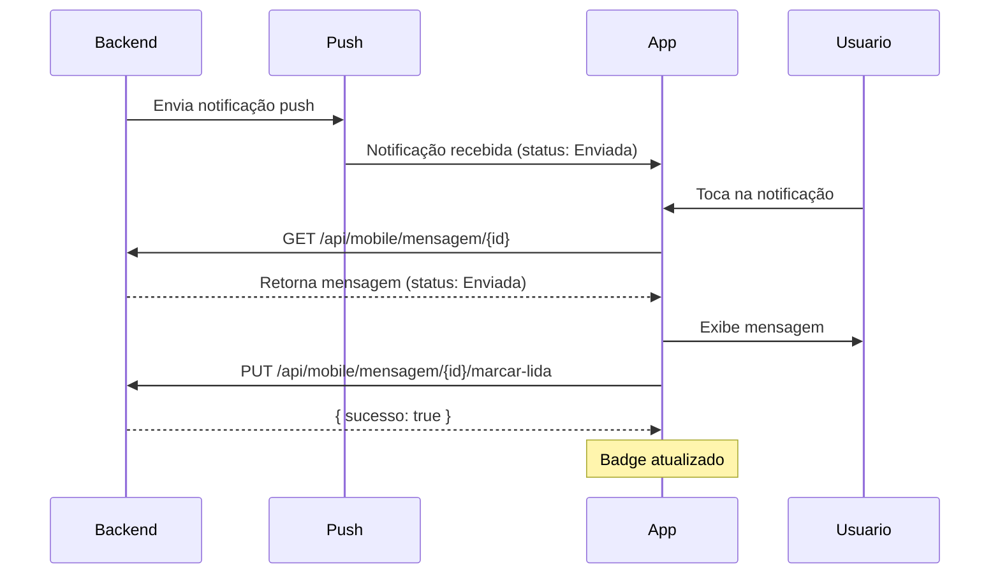

# API Mobile - Mensagens Agendadas

Documentação da API Mobile para gerenciamento de notificações/mensagens agendadas no aplicativo móvel.

## Índice
- [Autenticação](#autenticação)
- [Base URL](#base-url)
- [Endpoints](#endpoints)
- [Modelos de Dados](#modelos-de-dados)
- [Fluxo de Uso](#fluxo-de-uso)
- [Exemplos de Integração](#exemplos-de-integração)

---

## Autenticação

Todos os endpoints requerem autenticação via JWT Token.

**Header obrigatório:**
```
Authorization: Bearer {seu-token-jwt}
```

**Controle de Acesso:**
- O usuário móvel só pode acessar mensagens **destinadas a ele** (`UsuarioId`)
- O ID do usuário é extraído automaticamente do token JWT
- Tentativas de acesso a mensagens de outros usuários resultam em erro 403 (Forbidden)

---

## Base URL

```
/api/mobile/mensagem
```

---

## Endpoints

### 1. Listar Mensagens do Usuário

Lista todas as mensagens enviadas para o usuário logado.

**Endpoint:** `GET /api/mobile/mensagem/listar`

**Query Parameters:**
- `apenasNaoLidas` (opcional): `true` ou `false` (padrão: `false`)
  - `true`: Retorna apenas mensagens não lidas (status = Enviada)
  - `false`: Retorna todas as mensagens

**Exemplos:**
```
GET /api/mobile/mensagem/listar
GET /api/mobile/mensagem/listar?apenasNaoLidas=true
```

**Response:** `200 OK`
```json
[
  {
    "id": "3fa85f64-5717-4562-b3fc-2c963f66afa6",
    "titulo": "Lembrete de Coleta",
    "mensagem": "Não esqueça de realizar a coleta no talhão Norte hoje às 14h",
    "dataHoraEnvio": "2025-10-18T14:00:00",
    "dataHoraEnviada": "2025-10-18T14:00:05",
    "status": 1,
    "fcmToken": "token-fcm",
    "usuarioId": "guid-do-usuario",
    "funcionarioId": "guid-do-funcionario",
    "mensagemErro": null,
    "tentativasEnvio": 0
  },
  {
    "id": "7ba95f64-1234-4562-b3fc-2c963f66afa7",
    "titulo": "Atualização de Safra",
    "mensagem": "A safra foi atualizada com novos dados",
    "dataHoraEnvio": "2025-10-19T09:00:00",
    "dataHoraEnviada": "2025-10-19T09:00:03",
    "status": 4,
    "fcmToken": "token-fcm",
    "usuarioId": "guid-do-usuario",
    "funcionarioId": "guid-do-funcionario",
    "mensagemErro": null,
    "tentativasEnvio": 0
  }
]
```

**Status Codes:**
- `200 OK`: Lista retornada com sucesso
- `400 Bad Request`: Token inválido
- `401 Unauthorized`: Token não fornecido ou expirado

---

### 2. Buscar Mensagem por ID

Obtém detalhes de uma mensagem específica.

**Endpoint:** `GET /api/mobile/mensagem/{id}`

**Path Parameters:**
- `id` (obrigatório): GUID da mensagem

**Exemplo:**
```
GET /api/mobile/mensagem/3fa85f64-5717-4562-b3fc-2c963f66afa6
```

**Response:** `200 OK`
```json
{
  "id": "3fa85f64-5717-4562-b3fc-2c963f66afa6",
  "titulo": "Lembrete de Coleta",
  "mensagem": "Não esqueça de realizar a coleta no talhão Norte hoje às 14h",
  "dataHoraEnvio": "2025-10-18T14:00:00",
  "dataHoraEnviada": "2025-10-18T14:00:05",
  "status": 1,
  "fcmToken": "token-fcm",
  "usuarioId": "guid-do-usuario",
  "funcionarioId": "guid-do-funcionario",
  "mensagemErro": null,
  "tentativasEnvio": 0
}
```

**Status Codes:**
- `200 OK`: Mensagem encontrada
- `404 Not Found`: Mensagem não existe
- `403 Forbidden`: Mensagem não pertence ao usuário
- `400 Bad Request`: Token inválido

---

### 3. Marcar Mensagem como Lida

Marca uma mensagem como lida. Isso altera o status de `Enviada` (1) para `Lida` (4).

**Endpoint:** `PUT /api/mobile/mensagem/{id}/marcar-lida`

**Path Parameters:**
- `id` (obrigatório): GUID da mensagem

**Exemplo:**
```
PUT /api/mobile/mensagem/3fa85f64-5717-4562-b3fc-2c963f66afa6/marcar-lida
```

**Response:** `200 OK`
```json
{
  "sucesso": true,
  "message": "Mensagem marcada como lida com sucesso"
}
```

**Response em caso de erro:** `200 OK`
```json
{
  "sucesso": false
}
```

**Validações:**
- A mensagem deve existir
- A mensagem deve pertencer ao usuário logado
- A mensagem deve estar no status `Enviada` (1)

**Erros possíveis:**
```json
{
  "errors": [
    {
      "mensagem": "Mensagem não encontrada"
    }
  ]
}
```

```json
{
  "errors": [
    {
      "mensagem": "Você não tem permissão para marcar esta mensagem como lida"
    }
  ]
}
```

```json
{
  "errors": [
    {
      "mensagem": "Apenas mensagens enviadas podem ser marcadas como lidas"
    }
  ]
}
```

**Status Codes:**
- `200 OK`: Operação concluída (verificar campo `sucesso`)
- `400 Bad Request`: Token inválido ou dados inválidos

---

### 4. Listar Mensagens Não Lidas

Lista apenas as mensagens que ainda não foram lidas (status = Enviada).

**Endpoint:** `GET /api/mobile/mensagem/nao-lidas`

**Response:** `200 OK`
```json
[
  {
    "id": "3fa85f64-5717-4562-b3fc-2c963f66afa6",
    "titulo": "Lembrete de Coleta",
    "mensagem": "Não esqueça de realizar a coleta no talhão Norte",
    "dataHoraEnvio": "2025-10-20T14:00:00",
    "dataHoraEnviada": "2025-10-20T14:00:05",
    "status": 1,
    "fcmToken": "token-fcm",
    "usuarioId": "guid-do-usuario",
    "funcionarioId": "guid-do-funcionario",
    "mensagemErro": null,
    "tentativasEnvio": 0
  }
]
```

**Observações:**
- As mensagens são ordenadas por `dataHoraEnvio` (mais recentes primeiro)
- Retorna apenas mensagens com status `Enviada` (não marcadas como lidas)

---

### 5. Contar Mensagens Não Lidas

Retorna o total de mensagens não lidas e as últimas 10 mensagens.

**Endpoint:** `GET /api/mobile/mensagem/nao-lidas/contar`

**Response:** `200 OK`
```json
{
  "total": 25,
  "mensagens": [
    {
      "id": "3fa85f64-5717-4562-b3fc-2c963f66afa6",
      "titulo": "Lembrete de Coleta",
      "mensagem": "Não esqueça de realizar a coleta no talhão Norte",
      "dataHoraEnvio": "2025-10-20T14:00:00",
      "dataHoraEnviada": "2025-10-20T14:00:05",
      "status": 1,
      "fcmToken": "token-fcm",
      "usuarioId": "guid-do-usuario",
      "funcionarioId": "guid-do-funcionario",
      "mensagemErro": null,
      "tentativasEnvio": 0
    }
  ]
}
```

**Uso Recomendado:**
- Use este endpoint para exibir um badge/contador na interface do app
- As 10 mensagens mais recentes permitem preview rápido

---

## Modelos de Dados

### MensagemAgendadaResponseDTO

```typescript
{
  id: string;                    // GUID da mensagem
  titulo: string;                // Título da mensagem (max: 200 caracteres)
  mensagem: string;              // Conteúdo da mensagem (max: 1000 caracteres)
  dataHoraEnvio: string;         // Data/hora agendada (ISO 8601)
  dataHoraEnviada: string | null; // Data/hora que foi enviada (ISO 8601)
  status: number;                // Status da mensagem (enum)
  fcmToken: string | null;       // Token FCM do dispositivo
  usuarioId: string | null;      // GUID do usuário destinatário
  funcionarioId: string | null;  // GUID do funcionário que criou
  mensagemErro: string | null;   // Mensagem de erro (se houver)
  tentativasEnvio: number;       // Número de tentativas de envio
}
```

### StatusMensagem (Enum)

```typescript
enum StatusMensagem {
  Pendente = 0,    // Aguardando envio
  Enviada = 1,     // Enviada, mas não lida
  Falha = 2,       // Falha no envio
  Cancelada = 3,   // Cancelada pelo funcionário
  Lida = 4         // Lida pelo usuário mobile
}
```

**Estados relevantes para o mobile:**
- **Enviada (1)**: Mensagem chegou ao dispositivo, mas usuário ainda não leu
- **Lida (4)**: Usuário abriu e leu a mensagem no app

---

## Fluxo de Uso

### Cenário 1: Receber e Ler Notificação



### Cenário 2: Verificar Mensagens Não Lidas ao Abrir App

```
1. Usuário abre o app
2. App chama: GET /api/mobile/mensagem/nao-lidas/contar
3. App exibe badge com número de mensagens não lidas
4. Usuário acessa tela de notificações
5. App chama: GET /api/mobile/mensagem/nao-lidas
6. App lista todas as mensagens não lidas
7. Usuário seleciona uma mensagem
8. App marca como lida: PUT /api/mobile/mensagem/{id}/marcar-lida
```

---

## Exemplos de Integração

### React Native / Expo

```typescript
import axios from 'axios';

const API_BASE_URL = 'https://api.exemplo.com';
const token = 'seu-token-jwt';

// Configurar axios
const api = axios.create({
  baseURL: API_BASE_URL,
  headers: {
    'Authorization': `Bearer ${token}`,
    'Content-Type': 'application/json'
  }
});

// 1. Listar mensagens não lidas
async function listarMensagensNaoLidas() {
  try {
    const response = await api.get('/api/mobile/mensagem/nao-lidas');
    return response.data;
  } catch (error) {
    console.error('Erro ao listar mensagens:', error);
    throw error;
  }
}

// 2. Contar mensagens não lidas
async function contarNaoLidas() {
  try {
    const response = await api.get('/api/mobile/mensagem/nao-lidas/contar');
    return response.data; // { total: 5, mensagens: [...] }
  } catch (error) {
    console.error('Erro ao contar mensagens:', error);
    throw error;
  }
}

// 3. Marcar como lida
async function marcarComoLida(mensagemId: string) {
  try {
    const response = await api.put(`/api/mobile/mensagem/${mensagemId}/marcar-lida`);
    return response.data.sucesso;
  } catch (error) {
    console.error('Erro ao marcar como lida:', error);
    return false;
  }
}

// 4. Buscar mensagem por ID
async function buscarMensagem(id: string) {
  try {
    const response = await api.get(`/api/mobile/mensagem/${id}`);
    return response.data;
  } catch (error) {
    console.error('Erro ao buscar mensagem:', error);
    throw error;
  }
}

// Exemplo de uso em componente
function NotificacoesScreen() {
  const [mensagens, setMensagens] = useState([]);
  const [totalNaoLidas, setTotalNaoLidas] = useState(0);

  useEffect(() => {
    carregarMensagens();
  }, []);

  async function carregarMensagens() {
    const dados = await contarNaoLidas();
    setTotalNaoLidas(dados.total);
    setMensagens(dados.mensagens);
  }

  async function handleMarcarLida(id: string) {
    const sucesso = await marcarComoLida(id);
    if (sucesso) {
      // Atualizar lista
      await carregarMensagens();
    }
  }

  return (
    <View>
      <Text>Mensagens não lidas: {totalNaoLidas}</Text>
      {mensagens.map(msg => (
        <TouchableOpacity
          key={msg.id}
          onPress={() => handleMarcarLida(msg.id)}
        >
          <Text>{msg.titulo}</Text>
          <Text>{msg.mensagem}</Text>
        </TouchableOpacity>
      ))}
    </View>
  );
}
```

### Flutter / Dart

```dart
import 'package:http/http.dart' as http;
import 'dart:convert';

class MensagemService {
  final String baseUrl = 'https://api.exemplo.com';
  final String token;

  MensagemService(this.token);

  Future<List<dynamic>> listarNaoLidas() async {
    final response = await http.get(
      Uri.parse('$baseUrl/api/mobile/mensagem/nao-lidas'),
      headers: {
        'Authorization': 'Bearer $token',
        'Content-Type': 'application/json',
      },
    );

    if (response.statusCode == 200) {
      return json.decode(response.body);
    } else {
      throw Exception('Erro ao carregar mensagens');
    }
  }

  Future<Map<String, dynamic>> contarNaoLidas() async {
    final response = await http.get(
      Uri.parse('$baseUrl/api/mobile/mensagem/nao-lidas/contar'),
      headers: {
        'Authorization': 'Bearer $token',
        'Content-Type': 'application/json',
      },
    );

    if (response.statusCode == 200) {
      return json.decode(response.body);
    } else {
      throw Exception('Erro ao contar mensagens');
    }
  }

  Future<bool> marcarComoLida(String mensagemId) async {
    final response = await http.put(
      Uri.parse('$baseUrl/api/mobile/mensagem/$mensagemId/marcar-lida'),
      headers: {
        'Authorization': 'Bearer $token',
        'Content-Type': 'application/json',
      },
    );

    if (response.statusCode == 200) {
      final data = json.decode(response.body);
      return data['sucesso'] ?? false;
    } else {
      return false;
    }
  }
}
```

### cURL (Testes)

```bash
# Listar mensagens não lidas
curl -X GET "https://api.exemplo.com/api/mobile/mensagem/nao-lidas" \
  -H "Authorization: Bearer seu-token-jwt"

# Contar não lidas
curl -X GET "https://api.exemplo.com/api/mobile/mensagem/nao-lidas/contar" \
  -H "Authorization: Bearer seu-token-jwt"

# Marcar como lida
curl -X PUT "https://api.exemplo.com/api/mobile/mensagem/3fa85f64-5717-4562-b3fc-2c963f66afa6/marcar-lida" \
  -H "Authorization: Bearer seu-token-jwt"

# Buscar por ID
curl -X GET "https://api.exemplo.com/api/mobile/mensagem/3fa85f64-5717-4562-b3fc-2c963f66afa6" \
  -H "Authorization: Bearer seu-token-jwt"
```

---

## Boas Práticas

### 1. Atualização de Badge/Contador
```typescript
// Atualizar contador ao abrir o app
useEffect(() => {
  async function atualizarBadge() {
    const { total } = await contarNaoLidas();
    setBadgeCount(total);
  }

  atualizarBadge();
}, []);
```

### 2. Marcar como Lida ao Visualizar
```typescript
// Marcar automaticamente quando usuário abre a mensagem
async function abrirMensagem(mensagemId: string) {
  const mensagem = await buscarMensagem(mensagemId);

  // Exibir mensagem
  navigation.navigate('DetalheMensagem', { mensagem });

  // Marcar como lida em background
  if (mensagem.status === 1) { // Se estiver "Enviada"
    await marcarComoLida(mensagemId);
  }
}
```

### 3. Sincronização com Push Notifications
```typescript
// Quando recebe push notification
onNotificationReceived(async (notification) => {
  const mensagemId = notification.data.mensagemId;

  // Buscar detalhes completos da mensagem
  const mensagem = await buscarMensagem(mensagemId);

  // Atualizar contador
  const { total } = await contarNaoLidas();
  setBadgeCount(total);
});
```

### 4. Cache e Otimização
```typescript
// Usar cache para evitar requests desnecessários
const queryClient = new QueryClient();

function useMensagensNaoLidas() {
  return useQuery(
    ['mensagens', 'nao-lidas'],
    listarMensagensNaoLidas,
    {
      staleTime: 60000, // 1 minuto
      cacheTime: 300000, // 5 minutos
    }
  );
}
```

---

## Observações Importantes

1. **Status da Mensagem**: Apenas mensagens com status `Enviada` (1) podem ser marcadas como `Lida` (4)

2. **Permissões**: O usuário só pode acessar mensagens enviadas para ele (`UsuarioId`)

3. **Token JWT**: Sempre incluir o token no header `Authorization`

4. **Tratamento de Erros**: Verificar sempre o campo `errors` na resposta

5. **Datas**: Todas as datas estão no formato ISO 8601 (ex: `2025-10-18T14:00:00`)

6. **Sincronização**: Recomendado atualizar a lista de mensagens:
   - Ao abrir o app
   - Ao receber push notification
   - Ao voltar para tela de notificações

---

**Última atualização:** Outubro 2025
**Versão da API:** 1.0
**Plataformas suportadas:** iOS, Android (via React Native, Flutter, Native)
